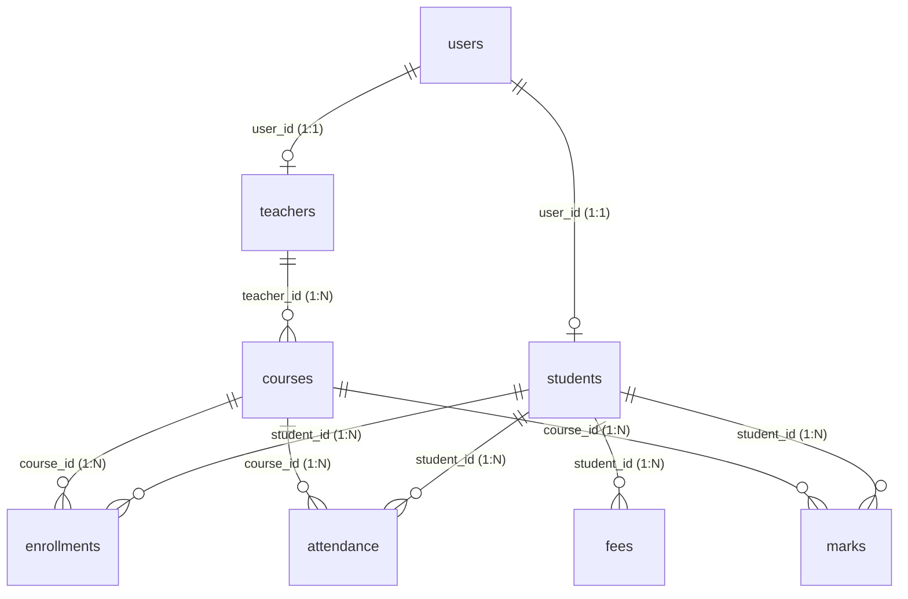

# AuraSMS - Enterprise Student Management System

A portfolio-grade, role-based Student Management System built using a clean, MVC-compliant Java web architecture. It leverages Jakarta EE specifications (Servlets 6.0 and JSP 3.1) deployed on Apache Tomcat 10, with a normalized MySQL database, JNDI connection pooling, and email-based OTP security.

---

## 📁 Project Architecture & Package Structure

AuraSMS enforces strict separation of concerns utilizing the **Model-View-Controller (MVC)** design pattern.

```
src/main/java/
  ├── com.sms.model/      # Plain Java POJOs representing database tables
  ├── com.sms.dao/        # All database operations using raw JDBC and PreparedStatements
  ├── com.sms.servlet/    # Controllers handling HTTP requests, routing, and data passing
  ├── com.sms.filter/     # Middleware intercepting paths and enforcing role permissions
  └── com.sms.util/       # Core utilities (JNDI Connection pool, SHA-256 password hashing)

src/main/webapp/
  ├── META-INF/           # Tomcat context configurations (holds secure DB credentials)
  ├── WEB-INF/            # Secure descriptor configuration (web.xml)
  └── views/              # View layer templates (JSPs using JSTL - zero Java scriptlets)
        ├── admin/        # Admin panel views
        ├── teacher/      # Faculty course logs and grades entry
        ├── student/      # Student profile, marks, and attendance logs
        └── common/       # Common fragments (navbars, error pages, login page, OTP page)
```

---

## 🗄️ Database Design (MySQL Schema)

The database schema (`schema.sql`) contains 8 normalized tables with enforced referential integrity and cascading rules to handle dependencies seamlessly.



1. **`users`**: Central authentication credentials, storing name, unique email, SHA-256 hashed password, and user `role` (`ENUM('ADMIN', 'TEACHER', 'STUDENT')`).
2. **`students`**: Extends user credentials with roll number, department, academic year, phone, and address. Referenced via `FOREIGN KEY (user_id) REFERENCES users(id) ON DELETE CASCADE`.
3. **`teachers`**: Stores department and qualification details of faculty members.
4. **`courses`**: Details course names, codes, credits, and links them to an assigned teacher.
5. **`enrollments`**: Many-to-many lookup table linking students to courses.
6. **`attendance`**: Daily log tracking status (`PRESENT`, `ABSENT`, `LATE`) per student per course.
7. **`marks`**: Academic marks obtained by students across exam types (`Internal`, `Midterm`, `Final`) per course.
8. **`fees`**: Tracking invoices, due dates, paid dates, and status (`PAID`, `UNPAID`, `OVERDUE`) per student.

---

## 🎓 Resume Interview Preparation Guide

Here are the precise answers to the questions HR and Technical interviewers will ask you regarding this project.

### 👥 HR Interview Questions & Answers

#### 💬 "Tell me about this project."
> "I built **AuraSMS**, a role-based Student Management System designed to handle real academic operations like enrollment, course management, attendance tracking, and grades. The system implements a strict Model-View-Controller (MVC) architecture using Java servlets on Tomcat. It features role-based views for Admin, Teachers, and Students, secured by standard filters and email-based OTP verification, utilizing connection pooling for high-performance database interactions."

#### 💬 "What was your role in this project?"
> "I was the **sole full-stack developer**. I handled the entire lifecycle—from normalization of the database schema (8 relational tables with cascading deletions) to creating JDBC DAO transactional methods in Java, mapping servlet routes, implementing middleware filters, and styling the frontend with responsive dark-theme glassmorphism using Bootstrap 5."

#### 💬 "What problem does this solve?"
> "It solves operational tracking and security silos in academic systems. In typical student systems, teachers, admins, and students use fragmented interfaces, and database credentials or logic layers are often mixed. This project consolidates operations into a single application where role-based access control restricts menus, auto-calculates GPA metrics, flags outstanding overdue invoices dynamically, and secures authentication using password hashing and OTP verification."

#### 💬 "How long did it take you to build?"
> "It took approximately **3 to 4 weeks** of active development. The first week was spent modeling the database, setting up JNDI configuration, and building the DAO CRUD layer. The second week was dedicated to servlet routing, core business math (GPA and attendance percentages), and filters. The remaining time was spent designing the glassmorphic frontend, testing edge cases, and implementing the asynchronous JNDI OTP mail system."

#### 💬 "What challenges did you face?"
> "My main challenge was **managing database transaction rollbacks in multi-table queries**. For example, when registering a student, we must first create a `user` record, obtain its auto-generated ID, and then create the `student` profile. If the student profile creation fails, the user record must not linger in the database. I resolved this by disabling `autoCommit` on the JDBC connection, wrapping the operations in a single transaction, and executing a rollback in the `catch` block to ensure transactional integrity."

---

### 💻 Technical Interview Questions & Answers

#### 💬 "Why did you choose Jakarta EE over Spring Boot?"
> "I chose Jakarta EE (Servlets, JSP, Filters) to understand **how web frameworks function under the hood**. Spring Boot abstracts servlet routing and database transactions behind annotations like `@RestController` and `@Transactional`. Implementing the raw MVC architecture myself forced me to master HTTP servlet life-cycles, JSTL tag-library compilation, session tracking, filters, connection pooling, and raw SQL transaction management, giving me a solid foundational grasp of the Java Web Spec."

#### 💬 "How does your login work? How do you handle sessions?"
> "When a user submits credentials, the `LoginServlet` intercepts the request and queries `UserDAO` to authenticate the user using SHA-256 hex hashed passwords. Upon successful authentication, it generates a secure 6-digit OTP code, stores the code and user details in the HTTP session as 'pending authentication', and sends an email. Once the user enters the correct code, the user is promoted to 'active' session status, bound under `session.setAttribute("user", user)`. We use cookie-based session tracking (`JSESSIONID`) managed by the Tomcat container with the `HttpOnly` flag enabled to prevent cross-site scripting (XSS) session hijacking."

#### 💬 "How did you prevent SQL injection?"
> "I prevented SQL injection by using **`PreparedStatement` placeholders (`?`) for every single database query**. Placeholders compile the SQL query template on the database server before merging parameter values. When parameters are bound (e.g. `ps.setString(1, input)`), they are treated strictly as literal values rather than executable SQL code, making SQL injection attacks impossible."

#### 💬 "How does role-based access work in your project?"
> "Access is controlled centrally by [AuthFilter.java](file:///Users/ntr/Desktop/Student%20Management%20System/src/main/java/com/sms/filter/AuthFilter.java) mapped to `/*`. When a request is made, the filter intercepts the relative URI. It extracts the logged-in user's role from the session and checks if the URI matches role prefixes like `/admin`, `/teacher`, or `/student`. If a user with a `STUDENT` role attempts to load `/admin/dashboard` or a page in `/views/admin/`, the filter intercepts it and forwards them to a styled Access Denied page, preventing bypass."

#### 💬 "If 1000 students are in the database, how does your search perform?"
> "The search performs efficiently because I implemented **database-level pagination and search filtering** in [StudentDAO.java](file:///Users/ntr/Desktop/Student%20Management%20System/src/main/java/com/sms/dao/StudentDAO.java#L33-L81). Instead of loading all records into JVM memory and sorting/filtering in Java (which would crash if data scaled to millions), the search parameters are injected directly into a SQL query using `LIMIT ? OFFSET ?`. The database handles the filtering and only returns the specific page size (e.g. 10 records) to the servlet, keeping database IO and memory footprint extremely low."

#### 💬 "Where is the business logic — in the servlet or DAO?"
> "The business logic resides in the **DAO/Service layer** (e.g., [MarksDAO.java](file:///Users/ntr/Desktop/Student%20Management%20System/src/main/java/com/sms/dao/MarksDAO.java) for GPA and [AttendanceDAO.java](file:///Users/ntr/Desktop/Student%20Management%20System/src/main/java/com/sms/dao/AttendanceDAO.java) for percentage calculations). The servlets act strictly as controllers; they read HTTP request parameters, call the DAO methods to obtain raw data or perform operations, and bind the result attributes to forward to JSPs. JSPs act purely as views, executing loops using JSTL `<c:forEach>` without any inline Java code."

#### 💬 "How would you add a new feature like notifications?"
> "I would add it by creating a new `Notification` model, a `NotificationDAO` for database operations, a `NotificationServlet` to expose APIs or view endpoints, and a `views/common/notifications.jsp` template. To decouple it, I would trigger notification dispatches in the existing code by calling `NotificationDAO.createNotification` inside relevant transaction methods (such as grade posting or fee invoicing)."

#### 💬 "What will break first if traffic increases?"
> "Under high traffic, the **database connections** will saturate first. If too many concurrent threads try to access the database without connection pooling, the system will exhaust MySQL's thread limit. I preempted this by configuring Tomcat JNDI connection pooling (`maxTotal=\"20\"`). If traffic exceeds this, the next bottleneck will be standard synchronous HTTP threads. We can scale this vertically by expanding the server thread pool, or horizontally by introducing a load balancer (like NGINX) in front of multiple Tomcat instances."

#### 💬 "How did you handle password security?"
> "We never store passwords in plaintext. During registration, the password is encrypted using a cryptographic SHA-256 hashing function in [PasswordUtil.java](file:///Users/ntr/Desktop/Student%20Management%20System/src/main/java/com/sms/util/PasswordUtil.java). When logging in, the entered plaintext password is hashed and compared to the stored hash. We also enforce session logout invalidation via `session.invalidate()` to purge session tokens."

#### 💬 "What design patterns did you use?"
> 1. **Data Access Object (DAO) Pattern**: Decoupling database queries from web controllers.
> 2. **Singleton Pattern**: Instantiating connection helper lookups.
> 3. **Model-View-Controller (MVC) Pattern**: Separating presentation from data models and routes.
> 4. **Interceptor/Filter Pattern**: Encapsulating cross-cutting authorization concerns.

---

## 🚀 Setup & Execution Guide

### 1. Database Initialization
Execute the SQL schema inside your local MySQL server:
```bash
mysql -u root -p < schema.sql
```

### 2. Configure Tomcat JNDI Credentials
Ensure database and SMTP credentials are set inside [context.xml](file:///Users/ntr/Desktop/Student%20Management%20System/src/main/webapp/META-INF/context.xml):
- `jdbc/SMSDB` contains your local MySQL password.
- `mail/Session` contains your SMTP credentials (optional, prints to log console if left default).

### 3. Build & Deploy
Compile and build the `.war` web package:
```bash
mvn clean package
```
Copy `target/sms.war` into your Tomcat `webapps/` directory and access the context at:
👉 **[http://localhost:8080/sms](http://localhost:8080/sms)**

### 4. Test Logins (Pre-Seeded)
- **Admin**: `admin@sms.com` / Password: `admin123`
- **Teacher**: `grace.hopper@sms.com` / Password: `teacher123`
- **Student**: `alice@sms.com` / Password: `student123`
*(OTP codes will print in your terminal logs or `catalina.out` for easy local verification.)*
